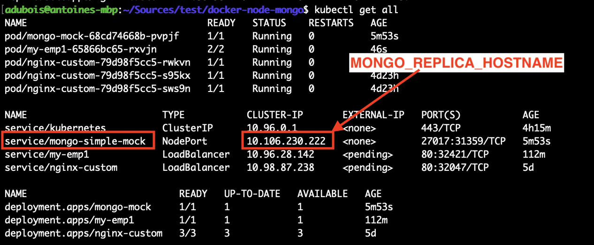

# Sample Node + Mongo Application

## Quick Start

### Using docker

```bash
docker-compose up --build
```

### Using Kubernetes

```bash
kubectl apply -f replicas/simple-mongo-replicas.yaml
```

Find replica service IP



```bash
vi kubernetes/demo.yaml # change MONGO_REPLICA_HOSTNAME
kubectl apply -f kubernetes/demo.yaml
```


## Docs

* [Cheat Sheet](docs/Cheatsheet.md)


## Next steps

* Create mongo cluster to mock replica
  * basic : https://github.com/fabric8io/configmapcontroller/tree/master/vendor/k8s.io/kubernetes/examples/nodesjs-mongodb
  * with helm : https://www.digitalocean.com/community/tutorials/how-to-scale-a-node-js-application-with-mongodb-on-kubernetes-using-helm

* Connect app to replica

* Document "how to work with", improve namings, replicas seeds

* Then: redis, mongo cluster for 360Stats, pipeline, ...
https://stackoverflow.com/questions/53031852/how-to-deploy-a-node-js-with-redis-on-kubernetes

